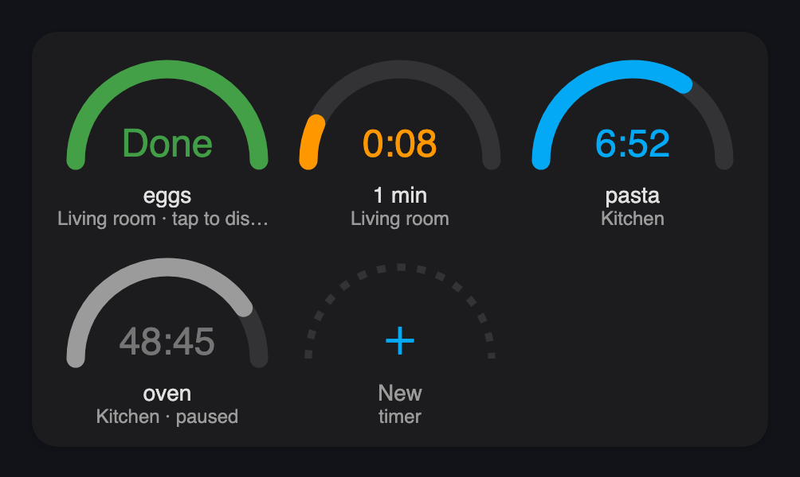
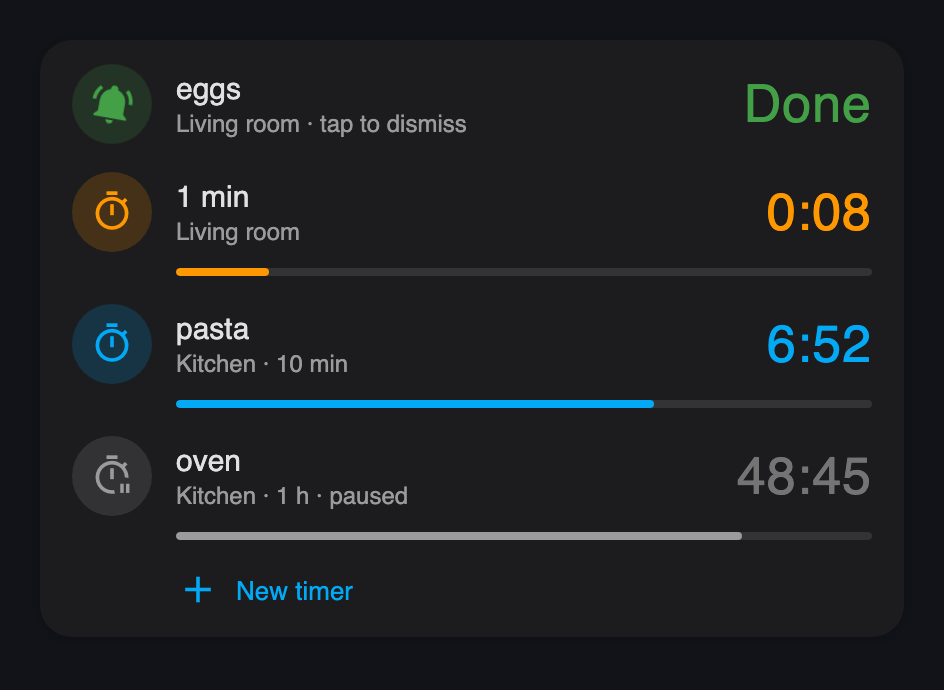
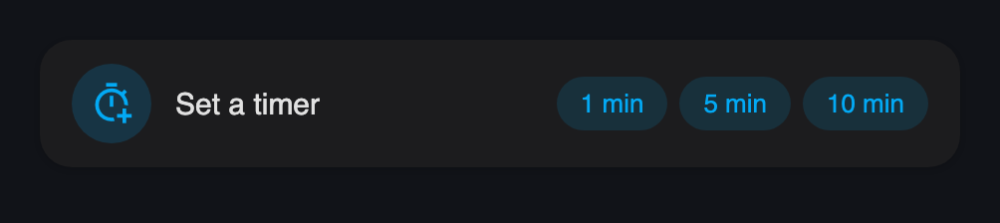
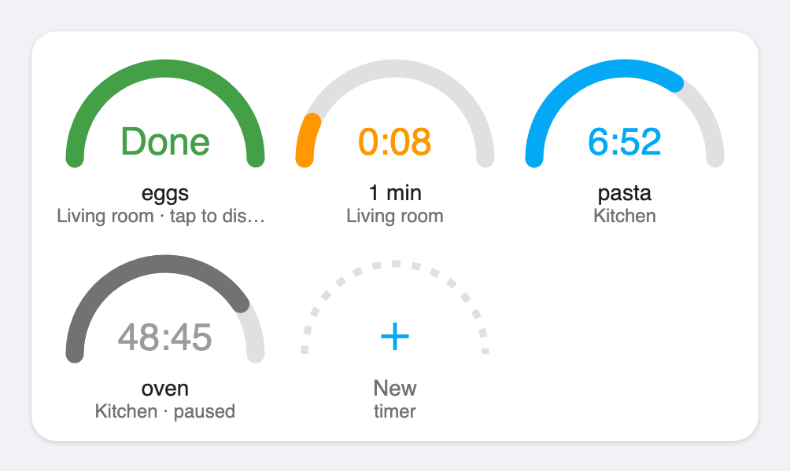

# Assist Timers for Home Assistant

See, set, pause and dismiss the timers of your Assist voice satellites (Home Assistant Voice PE and other ESPHome satellites) on a Home Assistant dashboard. **No firmware changes on the satellites.**

<p>
  
  
</p>

<p>
  
  
</p>

## Why this works without touching the firmware

Common wisdom says Voice PE timers live on the device. They don't. Assist timers live in Home Assistant: the `intent` integration's timer manager starts them, keeps the time and decides when they finish. A satellite only gets START / UPDATE / CANCEL / FINISH events, counts a display copy down for its LED ring, and rings when Home Assistant says FINISHED. (Checked in Home Assistant core `intent/timers.py` and ESPHome `voice_assistant.cpp`.)

So the real list of timers is in Home Assistant, and this project reads and controls it there:

- `HassTimerStatus` over Home Assistant's public intent API lists the timers of every satellite.
- `HassStartTimer` with a satellite's device id starts a timer *on that satellite*: it counts down on the LED ring and rings there, as if set by voice.
- A small integration stops a ringing satellite and pauses or resumes a timer by its id.

## Features

- Every timer of every satellite on one card: name (or duration), room, time left, progress. Seconds count down smoothly between updates.
- Tap a running timer to pause it, tap again to resume. Tap a ringing ("Done") timer to stop the ring.
- Set a timer from the dashboard: **+ New** opens a small form (minutes, seconds, satellite, name) that closes when the timer is set; **1 / 5 / 10 min** quick picks start one on your default satellite.
- Two card styles: half-circle gauges or a list. Header badges for sections views.
- A finished timer stays on the card as "Done" until the ring is dismissed on the satellite or from the card.
- English and Finnish, following the Home Assistant UI language. Theme colours, light and dark.
- A `sensor.assist_timers_alexa` entity in the Alexa Media Player format, so [Simple Timer Card](https://github.com/eyalgal/simple-timer-card) shows Assist timers too.

## Requirements

- Home Assistant 2026.9 or newer, with Assist satellites (tested with Home Assistant Voice PE).
- [button-card](https://github.com/custom-cards/button-card) v6+ for the cards.
- Optional: [browser_mod](https://github.com/thomasloven/hass-browser_mod) for the new-timer popup (without it the script's own form opens, which stays open after running). [Mushroom](https://github.com/piitaya/lovelace-mushroom) for the header badges.

## Installation

### 1. The integration (`assist_timer_ring`)

Needed for pausing, resuming and dismissing. Either add this repository to HACS as a custom repository of type *Integration* and install **Assist Timers**, or copy `custom_components/assist_timer_ring/` to your `config/custom_components/`. Then add to `configuration.yaml`:

```yaml
assist_timer_ring:
```

and restart Home Assistant.

### 2. The package

1. Create a long-lived access token (your profile → Security).
2. Add to `secrets.yaml`:
   ```yaml
   assist_timers_intent_url: "http://127.0.0.1:8123/api/intent/handle"
   assist_timers_bearer: "Bearer <your token>"
   ```
   Use `https://` and your host name if Home Assistant has `ssl_certificate` set.
3. Copy [`packages/assist_timers.yaml`](packages/assist_timers.yaml) to `config/packages/` and enable packages if you haven't:
   ```yaml
   homeassistant:
     packages: !include_dir_named packages
   ```
4. Keep the fast-changing sensors out of the recorder:
   ```yaml
   recorder:
     exclude:
       entities:
         - sensor.assist_timers
         - sensor.assist_timers_alexa
   ```
5. Optional: preselect a satellite for new timers and the quick picks by giving `script.assist_timer_start`'s `satellite` field a `default:` (a device id) in the package.
6. Check the configuration and restart. `sensor.assist_timers` should show a number, not `unavailable`.

If `/api/intent/handle` answers 404, add `intent:` to `configuration.yaml`. ([The REST API docs](https://developers.home-assistant.io/docs/api/rest/) ask for it; `default_config` normally loads it.)

### 3. The cards

Add a card (Add card → Manual) and paste one of:

- [`cards/timer-gauge.yaml`](cards/timer-gauge.yaml): half-circle gauges.
- [`cards/timer-list.yaml`](cards/timer-list.yaml): one row per timer.

For a sections view's header, paste [`cards/header-badges.yaml`](cards/header-badges.yaml) under the view's `badges:` in the raw configuration editor. Badges render with Home Assistant templates, which don't know the UI language: change `done_word` there to translate the "done" badge.

For Simple Timer Card, use the Alexa-format entity:

```yaml
type: custom:simple-timer-card
entities:
  - entity: sensor.assist_timers_alexa
    mode: alexa
```

Use `sensor.assist_timers_alexa`, not `sensor.assist_timers`: Simple Timer Card reads any `timers` attribute as Alexa data and shows nothing for it. These timers are read-only in Simple Timer Card.

## Using the cards

| Tap | Does |
|---|---|
| a running timer | pauses it |
| a paused timer | resumes it |
| a ringing ("Done") timer | stops the ring on its satellite |
| **+ New** / **Set a timer** | opens the new-timer form |
| **1 / 5 / 10 min** | starts a timer on the default satellite (the form, if there is no default) |

## Reference

### Entities

| Entity | |
|---|---|
| `sensor.assist_timers` | Number of timers. Attribute `timers`: `id`, `name`, `device_id`, `is_active`, `total_seconds_left`, `start_hours` / `start_minutes` / `start_seconds`, `language`. Polled every 5 s; `unavailable` if the request fails. |
| `sensor.assist_timers_finished` | Finished timers still ringing (attribute `finished`). |
| `sensor.assist_timers_alexa` | The timers in the Alexa Media Player format, for Simple Timer Card. |
| `script.assist_timer_start` | Set a timer: `minutes`, `seconds`, `satellite` (device id), `name`. |
| `script.assist_timers_dismiss` | Stop the ring on every satellite with a finished timer. |

### Services

| Service | |
|---|---|
| `assist_timer_ring.stop` | Stop the timer ring on an ESPHome satellite's media player (target: the media player). |
| `assist_timer_ring.pause` / `assist_timer_ring.unpause` | Pause or resume one timer; `timer_id` from `sensor.assist_timers`. |
| `rest_command.assist_timer_intent` | Run a timer intent: `intent` (`HassStartTimer`, `HassCancelTimer`, `HassIncreaseTimerTime`, …), `data` (its slots), optional `satellite` (device id). The intents pick a timer by name, area or start duration, not by id. |

## Limitations

- **Timers do not survive a Home Assistant restart.** The timer manager is in memory; after a restart the satellite's copy stops at zero and does not ring. That is Home Assistant's behaviour, not this project's. [ha-timers-alarms](https://github.com/amalg/ha-timers-alarms) and [hass_alarm](https://github.com/Gamer92000/hass_alarm) persist their own timers, but they replace the built-in ones, and then this project doesn't see them.
- **Stopping the ring from Home Assistant stops the sound only.** The ringing state is internal to the Voice PE firmware ([issue #318](https://github.com/esphome/home-assistant-voice-pe/issues/318)): the LED ring keeps its ringing pattern and music stays ducked until you say "stop", press the button or 15 minutes pass. `media_player.media_stop` does not work at all, because it reaches the media pipeline while the ring plays on the announcement pipeline; `assist_timer_ring.stop` sends the stop where the firmware does.
- **"Done" is inferred.** The API reports no finish event: a running timer that disappears with at most ~2 s left counts as finished, so one cancelled in its last seconds shows as done. The entry clears when the satellite's media player stops playing, at the latest after 15 minutes (when Voice PE stops ringing by itself), or after one minute for satellites without a media player. Music playing on the satellite keeps it until the music stops.
- **Other timer add-ons can intercept "set a timer".** If an integration ships its own `custom_sentences` for timers, voice timers no longer reach Home Assistant's timer manager and the sensor stays empty.
- **Delayed commands** ("turn off the lights in 10 minutes") are not listed; `HassTimerStatus` leaves them out.
- The integration reads two internals of Home Assistant: the ESPHome media player entity's API client, and the intent component's timer manager. The tests check both; if an update changes them, the services raise an error instead of silently doing nothing.

## The future: `timer_list`

Home Assistant is getting a native [`timer_list` entity](https://github.com/home-assistant/architecture/discussions/1407) ([core PR #183648](https://github.com/home-assistant/core/pull/183648); moving Assist timers onto it is a later step, [draft #174847](https://github.com/home-assistant/core/pull/174847)). When that lands, the polling sensor, the token, the REST command and the pause/resume services become unnecessary: the cards will read `timer_list` entities directly. Stopping a Voice PE's ring will still need `assist_timer_ring.stop` until the firmware exposes it.

## Related projects

- [Simple Timer Card](https://github.com/eyalgal/simple-timer-card): shows Voice PE timers via an ESPHome firmware change; works with `sensor.assist_timers_alexa` from this project instead.
- [voice-assistant-persistent-timers](https://github.com/Djelibeybi/voice-assistant-persistent-timers): replaces Assist timers with `timer` helpers (firmware change).
- [ha-timers-alarms](https://github.com/amalg/ha-timers-alarms), [hass_alarm](https://github.com/Gamer92000/hass_alarm): their own timers and alarms for voice satellites, persisted across restarts.

## Development

```sh
uv sync --extra dev
uv run pytest -q
```

The tests run the package against a real Home Assistant core ([pytest-homeassistant-custom-component](https://github.com/MatthewFlamm/pytest-homeassistant-custom-component)): a satellite is simulated the way ESPHome registers one, timers are started with the real `HassStartTimer` intent, and the sensor polls the real HTTP API with a real token. The card templates run in Node with button-card's template parameters; `sensor.assist_timers_alexa` is checked against Simple Timer Card's own parser.

`uv run python tools/screenshots.py` renders the screenshots with the real card templates in headless Chrome.

## License

[MIT](LICENSE). `tests/vendor/simple_timer_card_alexa.js` is extracted from [Simple Timer Card](https://github.com/eyalgal/simple-timer-card) (MIT, © 2025 Eyal Gal) for compatibility tests.
